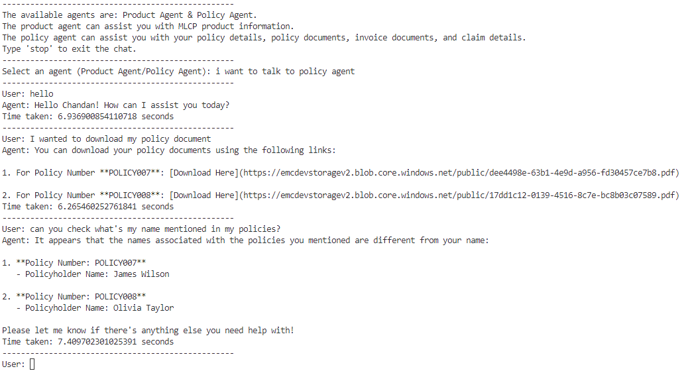
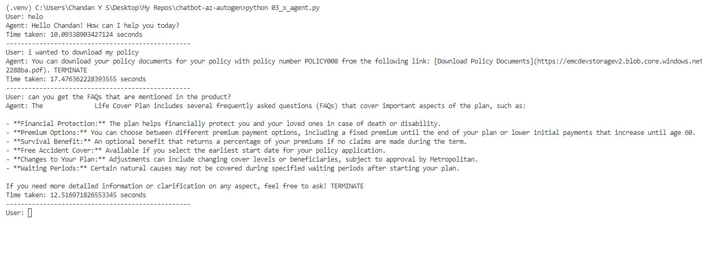

# Chatbot with Azure OpenAI and Microsoft's AutoGen

This project is a chatbot implementation using Microsoft's AutoGen framework and Azure OpenAI services. The chatbot is designed to handle various tasks, including retrieving product information, policy details, claim details, and more.

## Features

- **Product Information**: Retrieve information about product.
- **Policy Details**: Fetch details about user policies based on policy numbers.
- **Claim Details**: Get information about claims using claim IDs.
- **Document Retrieval**: Retrieve policy and invoice documents.
- **Asynchronous Operations**: Handle tasks asynchronously for better performance.
- **Memory Management**: Utilize memory stores to keep track of user preferences and context.
- **Multi-Agent System**: Use different strategies for agent collaboration (RoundRobin and Selector).

## Installation

1. **Clone the repository**:

   ```sh
   git clone https://github.com/iamchandanys/chatbot-az-autogen.git
   cd chatbot-az-autogen
   ```

2. **Create a virtual environment**:

   ```sh
   python -m venv .venv
   ```

3. **Activate the virtual environment**:

   - On Windows:
     ```sh
     .venv\Scripts\activate
     ```
   - On macOS/Linux:
     ```sh
     source .venv/bin/activate
     ```

4. **Install the dependencies**:

   ```sh
   pip install -r requirements.txt
   ```

5. **Set up environment variables**:
   Create a [.env](http://_vscodecontentref_/2) file in the root directory and add your Azure OpenAI credentials:
   ```env
   api_key=your_api_key
   deployment_name=your_deployment_name
   model_name=your_model_name
   api_version=your_api_version
   azure_endpoint=your_azure_endpoint
   api_to_upload_files=api_to_upload_files
   ```

## Usage

### Running the Chatbot

There are two entry points for running the chatbot, each using a different strategy for agent collaboration:

1. **RoundRobinGroupChat**: This strategy involves agents taking turns in a round-robin fashion.

   ```sh
   python 03_x_agent.py
   ```

2. **SelectorGroupChat**: This strategy involves selecting the most appropriate agent for each task.
   ```sh
   python 03_x_agent_v2.py
   ```

### Interacting with the Chatbot

- The chatbot will prompt you for input.
- Type your queries and get responses from the chatbot.

## Project Structure

- [03_x_agent.py](https://github.com/iamchandanys/chatbot-az-autogen/blob/main/03_x_agent.py): Entry point for the chatbot using [RoundRobinGroupChat](https://microsoft.github.io/autogen/stable/user-guide/agentchat-user-guide/tutorial/teams.html#creating-a-team).
- [03_x_agent_v2.py](https://github.com/iamchandanys/chatbot-az-autogen/blob/main/03_x_agent_v2.py): Entry point for the chatbot using [SelectorGroupChat](https://microsoft.github.io/autogen/stable/user-guide/agentchat-user-guide/selector-group-chat.html#selector-group-chat).
- [system_prompts.py](https://github.com/iamchandanys/chatbot-az-autogen/blob/main/system_prompts.py): Contains system messages for different agents.
- [system_tools.py](https://github.com/iamchandanys/chatbot-az-autogen/blob/main/system_tools.py): Defines the tools used by the agents to perform various tasks.
- [README.md](https://github.com/iamchandanys/chatbot-az-autogen/blob/main/README.md): This file, providing an overview of the project.
- [.env](http://_vscodecontentref_/9): Environment variables for Azure OpenAI credentials (not included in the repository).

## Screenshots

Here are some screenshots of the chatbot in action:

### Example Conversation (SelectorGroupChat)



### Example Conversation (RoundRobinGroupChat)


